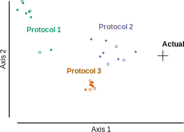
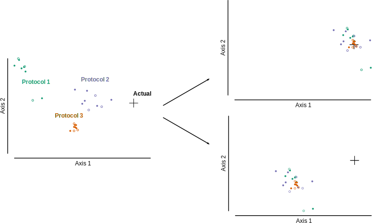
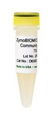
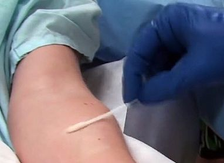
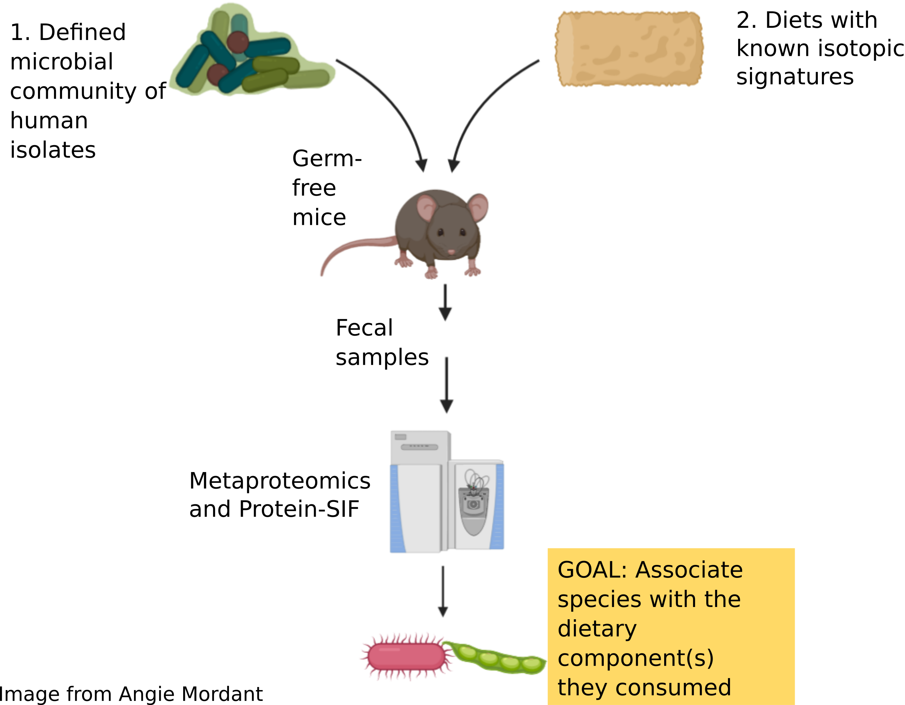
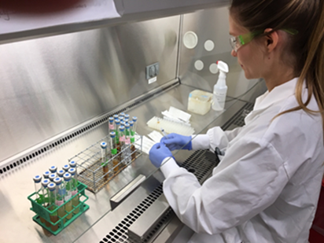
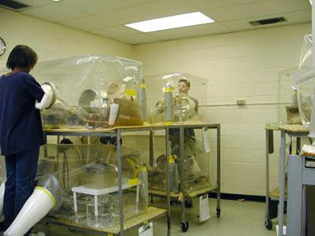
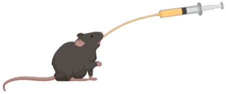
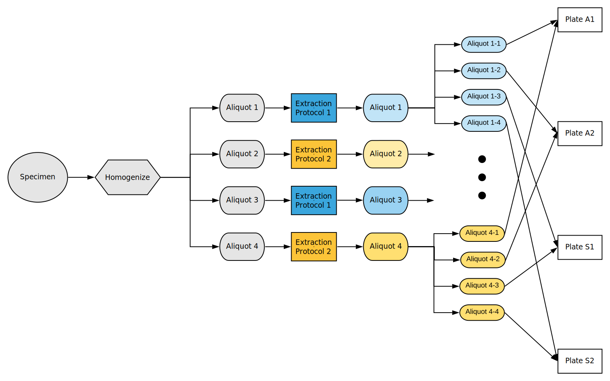
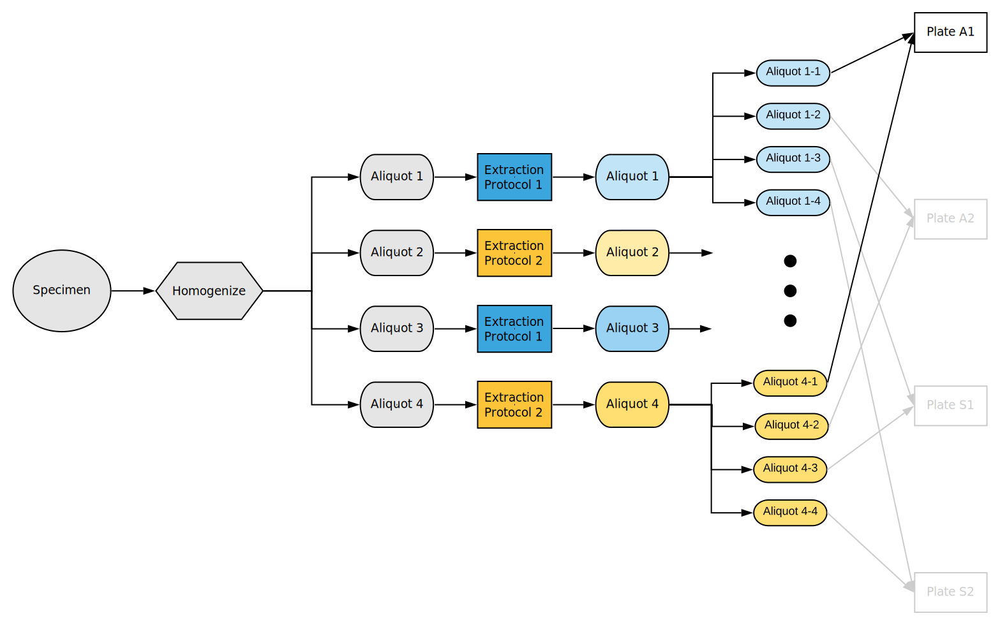

<!-- Measuring differential bias between metagenomics protocols provides a
method for validating microbiome calibration controls -->

<!-- Setup {{{1 -->

```{r setup, include = FALSE}
knitr::opts_knit$set(progress = TRUE, verbose = TRUE)
# Global chunk options
knitr::opts_chunk$set(
  cache = TRUE, autodep = TRUE,
  include = FALSE, echo = FALSE,
  warning = TRUE, message = FALSE, 
  fig.width = 8, fig.height = 6,
  comment = "#>", collapse = TRUE,
  # dev = "svg"
  dev = "png", fig.retina = 2
)
```

```{r load_packages}
library(speedyseq)
# library(phyloseqpp)
library(here)
library(tidyverse)
library(cowplot)
# library(ggridges)
library(ggbeeswarm)
# library(ggforce)
# Load local metacal dev version for pairwise_ratios()
devtools::load_all("~/research/r-packages/metacal")
```

```{r}
my_psmelt <- function(physeq) {
  speedyseq::psmelt(physeq) %>%
    as_tibble %>%
    rename(taxon = OTU, sample = Sample, abundance = Abundance)
}
as_tibble.phyloseq <- function(x) {
  x %>% my_psmelt
}
as_tibble.sample_data <- function(x) {
  x %>% as("data.frame") %>% as_tibble(rownames = "sample")
}
as_tibble.taxonomyTable <- function(x) {
  x %>% as("matrix") %>% as_tibble(rownames = "taxon")
}
as_tibble.XStringSet <- function(x) {
  x %>% as.character %>% enframe("taxon", "sequence")
}
```

```{r}
font_size = 12
theme_set(theme_cowplot(font_size))
```

```{r data_setup}
ps <- readRDS(here("results", "a1", "a1-phyloseq-silva-v138.Rds")) %>%
  filter_taxa2(~sum(.) >= 10)
dna_sam <- here("sample-data", "dna-sample-data.Rds") %>%
  readRDS %>%
  mutate_at("extraction_batch", as.character)
assignments <- here("results", "a1", "a1-asv-strain-assignments.csv") %>%
  read_csv
# Add cols vv_organism and vv_source to the tax table for the inoc + fecal
tmp <- assignments %>%
  # filter(str_detect("in
  transmute(
    taxon = feature_id,
    vv_organism = paste(genus, species),
    vv_source = case_when(
      str_detect(source, "inoculum") ~ "inoculum",
      source %in% c("fecal", "T. mobilis") ~ source,
      TRUE ~ "Other"
    )
  )
new_tax <- tax_table(ps) %>%
  as_tibble %>%
  left_join(tmp, by = "taxon") %>%
  replace_na(list(vv_source = "Other")) %>%
  column_to_rownames("taxon") %>%
  as("matrix") %>%
  tax_table
tax_table(ps) <- new_tax
rm(tmp, new_tax)
# Tibbles for downstream use
sam <- sample_data(ps) %>% as_tibble
tax <- tax_table(ps) %>% as_tibble
pstb <- ps %>%
  as_tibble %>%
  mutate_by(sample, 
    proportion = close_elts(abundance)
  )
```

```{r ps.simp}
# Get a simplified phyloseq object with the inoculum ASVs merged to
# `vv_organism`, T. mobilis, and all others lumped into "Other".
group <- tax %>%
  mutate(
    group = case_when(
      vv_source %in% c("inoculum", "T. mobilis") ~ vv_organism,
      vv_source %in% c("fecal", "Other") ~ "Other",
    )
  ) %>%
  pull(group)
ps.simp <- ps %>%
  merge_taxa_vec(group, tax_adjust = 0)
tax_table(ps.simp)[tax_table(ps.simp)[,"vv_source"] == "Other",] <- "Other"
taxa_names(ps.simp) <- tax_table(ps.simp)[,"vv_organism"]
tax.simp <- tax_table(ps.simp) %>% as_tibble
ps.simp.sub <- ps.simp %>%
  subset_samples(specimen_type %in% c("fecal", "inoculum"))
```

```{r colors}
palette_list <- c("Blues", "Greens", "Reds", "Purples", "Oranges", 
      "Greys")
# Color tibble
color_tb <- tax_table(ps.simp) %>%
  as_tibble %>%
  select(phylum, vv_organism) %>%
  distinct %>%
  arrange(phylum, vv_organism) %>%
  group_by(phylum) %>%
  summarize(vv_organism = list(vv_organism), n = n()) %>%
  mutate(
    phylum = fct_relevel(phylum, "Other", after = Inf)
  ) %>%
  arrange(phylum) %>%
  mutate(
    palette = palette_list[row_number()],
    # Note, brewer.pal always returns at least 3 colors, so for n < 3 we'll
    # explicitly ask for 3 and then subset to just the first n
    color = map2(n, palette, 
      ~RColorBrewer::brewer.pal(n = max(.x, 3), name = .y) %>% tail(.x)
    )
  ) %>%
  unnest(cols = c(vv_organism, color)) %>%
  mutate(color = ifelse(vv_organism == "Other", "lightgrey", color))
# color brewer palettes for other plots
palettes = c(
  specimen_type = 6,
  host_sex = 6,
  extraction_protocol = 1,
  taxon = 2,
  sex_batch = 6
)
```

```{r plotting_functions}
prop_plot <- function(ps, min_prop = NULL) {
  ptb <- ps %>% as_tibble %>%
    mutate(proportion = abundance / reads_final) %>%
    mutate(taxon = factor(taxon, taxa_names(ps)))
  if (is.null(min_prop)) {
    min_prop <- ptb %>%
      filter(proportion > 0) %>%
      pull(proportion) %>%
      min %>%
      {signif(. / 3, 2)}
  }
  ptb %>%
    ggplot(aes(taxon, log10(proportion + min_prop), color = taxon)) +
    geom_quasirandom(groupOnX = TRUE) +
    scale_color_brewer(type = "qual", palette = palettes["taxon"], 
      guide = FALSE) +
    labs(
      y = str_glue("log10(proportion + {min_prop})"),
      x = "Specimen type",
      title = "Proportion of ASVs by specimen type"
    ) +
    facet_wrap(~specimen_type, scales = "fixed") +
    theme(
      panel.spacing = unit(0.05, "npc"),
    )
}

cor_plot <- function(ps) {
  stopifnot(ntaxa(ps) == 2)
  asvs <- taxa_names(ps)
  ps %>%
    as_tibble %>%
    select(-rank_names(ps)) %>%
    mutate(abundance = abundance / reads_final) %>%
    pivot_wider(names_from = taxon, values_from = abundance) %>%
    # ggplot(aes_string(asvs[1], asvs[2], color = "specimen_type")) +
    ggplot(aes_string(asvs[1], asvs[2])) +
    geom_point() +
    # scale_color_brewer(type = "qual", palette = 2) +
    facet_wrap(~specimen_type, scales = "free") +
    labs(
      title = "Correlation between ASV proportions in each specimen type"
    ) +
    theme(
      panel.spacing = unit(0.05, "npc"),
    )
}

#' @param ps A phyloseq object subset to the ASVs putatively from the same
#' genome
#' @param cn The purported CN of that genome
cn_plot <- function(ps, cn) {
  copy_number <- cn
  ps %>%
    as_tibble %>%
    mutate_by(sample, 
      abundance_per_genome = copy_number * abundance / sum(abundance)
    ) %>%
    mutate(
      taxon = fct_reorder(taxon, abundance_per_genome, .desc = TRUE)
    ) %>%
    ggplot(aes(x = taxon, y = abundance_per_genome,
        color = taxon)) +
    geom_quasirandom(groupOnX = TRUE, alpha = 0.5) +
    scale_y_continuous(
      limits = c(0, copy_number), 
      breaks = seq(0, copy_number)
    ) +
    # stat_summary() +
    facet_wrap(~specimen_type) +
    theme_minimal_hgrid(font_size) +
    scale_color_brewer(type = "qual", palette = palettes["taxon"],
      guide = FALSE) +
    labs(
      x = "Amplicon sequence variant", 
      y = "Est. abundance per genome",
      title = str_glue("Estimated per-genome ASV abundances assuming CN = {cn}")
    ) +
    theme(
      panel.spacing = unit(0.05, "npc"),
    )
}

cor_and_cn_plot <- function(ps, cn = NA) {
  p2 <- cor_plot(ps)
  if (is.na(cn))
    p3 <- NULL
  else
    p3 <- cn_plot(ps, cn)
  plot_grid(p2, NULL, p3,
    ncol = 1,
    rel_heights = c(1, 0.00, 1)
  )
}
```

<!-- Introduction {{{1 -->

# Different metagenomics protocols make <br> different microbiome measurements

<br>



???

TODO: switch orientation to match next slide; may need to use layout

Metagenomics-based microbiome measurements have protocol-specific biases that
cause some taxa to be overestimated while others go virtually undetected.

---

# Bias estimated from control samples can be used <br> to correct target samples (calibration)



???

left panel: calibration schematic; right panel: calibration before/after. Or
just show calibration schematic.

We (and others?) have previously proposed a methodology for measuring bias from
control samples and correcting it in co-measured unknown samples (calibration). 

---

# Calibration controls must reflect bias in the target samples

<!--  -->

.pull-left[
  .center[
  <br> <br> <br> <br>
   
  ]
]

.pull-right[



]


???

Industrial, academic, and governmental organizations have developed microbiome
control materials for characterizing the bias of a given protocol. E.g. Zymo,

But control communities differ from natural samples in a variety of ways (such
as) ...

how do we know that the bias in the controls accurately reflects the bias in
measurements of natural samples?

(on left, show a mock community ideally zymo; on the right, show different
types of natural samples e.g. stool, swab, soil) 

So we need a way to test that bias is consistent between control and natural
samples.

---

<!-- Task -->

# Goal: Develop a method to test whether bias is consistent <br> across sample types and apply it to fecal microbiomes

.pull-left[
<figure>
  
  <figcaption>
  Ben Callahan (NCSU)
  </figcaption>
</figure>
<br>
<figure>
  
  &nbsp; &nbsp;
  
  <figcaption>
  David Clausen & Amy Willis (UW Biostatistics)
  </figcaption>
</figure>
]
.pull-right[
<br>
<br>
<figure>
  
  &nbsp; &nbsp;
  
  <figcaption>
  Angie Mordant & Manuel Kleiner (NCSU Plant and Microbial Biology)
  </figcaption>
</figure>
]

???

We are developing an experimental and statistical methodology for such
assessments and apply it to test whether bias is consistent between artificial
and natural communities.

(show collabs on the slide, perhaps split between experimenters and
non-experimenters)
perhaps show two icons for the artificial and natural samples that I'll use
throughout; e.g. a test tube and a poop emoji

main message

Today I'm going to describe the methodology, the experiment, and my initial
analysis of our the data we have so far.

(perhaps revise this after writing body and conclusions). Consider bringing in
all collaborators here.

---

<!-- Body {{{1 -->
<!-- The experiment {{{2 -->

# Problem: Can't measure bias in natural samples <br> because the true composition is unknown

<br>


---

# Solution: Measure the differential bias between protocols <br> &nbsp;

<br>


<br>

--

* Differential bias = Bias of Protocol 1 / Bias of Protocol 2, <br>
  but can be measured without knowing either

* Inconsistent differential bias &harr; inconsistent bias (approx.)

???

The primary difficulty facing such assessments is that a protocol's bias cannot
be measured in natural samples, as their true composition is unknown. We
surmount this problem by instead measuring the differential bias between
different protocols applied to the same sample. Inconsistent differential bias
-> inconsistent bias in one or both protocols.

This approach requires applying multiple protocols applied to different sample
types containing the same taxa

---

# Proposed validation method: Compare differential bias<br>in control and natural communities


--

.center[
### Ideal (initial) experiment: Same strains in both sample types
]


---

layout: true

# Mordant and Kleiner mouse experiment: <br> Who eats what in the gut

---



???
angie + manuel experiment: Gnotobiotic (known life) mice - inoculated with
microbial consortium, aim to understand how bacteria consume mouse diet; 

Our question: Is bias of the inoculum taxa the same in the lab-created mixtures
and mouse fecal pellets? Might differ b/c the microbes are in a different
matrix and have potentially physiological differences. Also a validation of
this methodology. 

Task: Apply different extraction and sequencing protocols, to measure the
differential bias.

---


&nbsp;


.pull-left[

]
.pull-right[

* 200uL of fresh inoculum per mouse

* gavaged 3 consecutive days, <br>weeks 1 and 5

* fecal pellets collected, weeks 2 and 6
]
.footnote[
Images from Angie Mordant
]

---

layout: true

# Each specimen measured by 2 extraction protocols <br> &times; 2 replicates &times; 4 sequencing methods

<!-- # 1 specimen X 2 extraction protocols X 2 technical replicates X 4 sequencing centers -->

---



---



???

Extraction protocol 1: Modified Fast DNA Stool
Extraction protocol 2: Modified DNeasy Blood and Tissue

---

layout: false

# Specimen overview

```{r, include = FALSE}
tb <- dna_sam %>%
  mutate_at("collection_week", as.character) %>%
  mutate_if(is.character, fct_explicit_na, "-") %>%
  rename(
    batch = extraction_batch,
    week = collection_week,
    # `cage/sex` = host_sex
  )
```

```{r, include = TRUE}
tb %>%
  filter(aliquot_number == 1) %>%
  group_by(specimen_type) %>%
  count %>%
  knitr::kable("html")
```

<br><br>

.pull-left[
Fecal (mouse) specimens
```{r, include = TRUE}
tb %>%
  filter(aliquot_number == 1, specimen_type == "fecal") %>%
  group_by(batch, week, host_sex) %>%
  count %>%
  knitr::kable("html")
  # knitr::kable("html", align = "cccc")
```
]
.pull-right[
Inoculum specimens
```{r, include = TRUE}
tb %>%
  filter(aliquot_number == 1, specimen_type == "inoculum") %>%
  group_by(batch, week) %>%
  count %>%
  knitr::kable("html")
  # knitr::kable("html", align = "cccc")
```
]

---

# The two protocols had specimen-type-specific <br> differences in DNA yield

```{r, include = TRUE, fig.width = 8, fig.asp = 0.8}
dna_sam %>%
  filter(specimen_type %in% c("fecal", "inoculum", "T. mobilis")) %>%
  ggplot(aes(specimen_type, dna_conc, color = extraction_protocol)) +
  geom_boxplot() +
  geom_quasirandom(dodge.width = 0.75) +
  # scale_y_sqrt(breaks = c(0.1, 1, 5, 10, 20, 30)) +
  scale_y_log10() +
  facet_wrap(~extraction_batch,
    labeller = as_labeller(function(x) paste("Batch", x))
  ) +
  scale_color_brewer(type = "qual") +
  labs(
    x = "Specimen type", y = "DNA concentration (ng/uL)",
    color = "Extraction Protocol",
    title = "DNA concentration by protocol, specimen type, and batch"
  ) +
  theme(
    legend.position = "bottom",
    panel.spacing = unit(0.03, "npc")
  )
```

???

useful to talk about here.
- difference between inoc and natural samples - creates a difference between
  inoc and natural samples that we didn't initially intend; could affect bias
  (though not expected) but perhaps just noise.
- difference in yields flipped - indicates inconsistent bias? or an effect of
  host DNA, or cell concentration?

---

<!-- Preparatory analysis {{{2 -->

# Bioinformatic analysis of A1 sequencing data

<br>

1. Use DADA2 to filter and correct sequencing errors

  - Obtain amplicon sequence variant (ASVs) abundance matrix

--

2. Assign Silva taxonomy to all ASVs with built-in DADA2 functions

  - Useful but insufficient for identifying to species and strain level

--

3. Make custom assignments of ASVs to experimental strains

  - Find ASVs that exactly match a reference sequence for experimental strain

  - Find additional ASVs that appear to be from the same genome


---

# DADA2 yields a matrix of counts for each sample <br> and amplicon sequence variant (ASV)

First 5 samples and ASVs:
```{r, include = TRUE, echo = FALSE}
otu_table(ps) %>% corner(5,5) %>% knitr::kable("html")
```
<br>
```{r, include = TRUE}
refseq(ps) %>% head(5)
```

---

# Custom assignment of experimental strains

<br>

```{r, include = TRUE}
tax %>%
  select(asv = taxon, silva_genus = genus, starts_with("vv")) %>%
  slice(1:11) %>%
  knitr::kable("html")
```

.footnote[
(First 11 ASVs shown)
]

???

- only showing first 11 ASVs
- All expected strains detected + others
- Agree with Silva but not a 1-1 match. E.g. Clostridium symbiosum.
- 2 ASVs per strain - sometimes both in custom reference, sometimes not. E.g.
  B. ovatus, not.
- Abundant ASV6 - putative inoc contaminant. Few other rare putative inoc
  contaminants

---

# ASVs from the same genome identified by <br> genetic distance, correlation, and expected ratio

.left-column[
Bacteroides ovatus
]

.right-column[
```{r, include = TRUE, fig.width = 7, fig.asp = 1}
ps %>%
  # prune_taxa(c("A1_ASV1", "A1_ASV8"), .) %>%
  subset_taxa(vv_organism == "Bacteroides ovatus") %>%
  subset_samples(specimen_type %in% c("inoculum", "fecal")) %>%
  cor_and_cn_plot(cn = 5)
```
]

???

TODO: try to remove extra padding at the top of the right column

---

# E. coli in the inoculum versus the fecal (mice) samples


```{r}
d <- ps %>%
  subset_taxa(vv_organism == "Escherichia coli") %>%
  refseq %>%
  Biostrings::stringDist(method = "hamming")
```

* ASV2 matches the E. coli H2 reference

* ASV14 differs from ASV2 by `r d` nucleotide;
  <br> only present in fecal samples

```{r, include = TRUE, fig.asp = 0.6}
ps %>%
  # prune_taxa(c("A1_ASV2", "A1_ASV14"), .) %>%
  subset_taxa(vv_organism == "Escherichia coli") %>%
  subset_samples(specimen_type %in% c("inoculum", "fecal")) %>%
  prop_plot(1e-4)
```

---

# Correlation suggests same genome, but ratio is off expectation

.left-column[
Escherichia coli
]
.right-column[
```{r, include = TRUE, fig.width = 7, fig.asp = 1}
ps %>%
  # prune_taxa(c("A1_ASV2", "A1_ASV14"), .) %>%
  subset_taxa(vv_organism == "Escherichia coli") %>%
  subset_samples(specimen_type %in% c("inoculum", "fecal")) %>%
  cor_and_cn_plot(cn = 7)
```
]

???

The true ratio is roughly 4:1 (so would actually look good if I used the CN=5
from the previous figure.

TODO: remove right column and add possible explanations instead

Possible explanations?

---


# Pattern of cross-contamination from positive controls <br> indicates index switching at about 0.4% per sample

```{r, include = TRUE, fig.width = 9, fig.asp = 0.8, warning = FALSE}
pstb %>%
  filter(genus == "Thioflavicoccus") %>%
  mutate(
    row = fct_rev(row),
    proportion2 = signif(proportion, 2),
    # label = str_glue("{abundance} reads\n {proportion2}"), 
    label = str_glue("{abundance}\n {proportion2}"), 
  ) %>%
  filter(specimen_type != "T. mobilis") %>%
  ggplot(aes(y = row, x = column, fill = abundance)) +
  geom_raster() +
  geom_text(data = ~filter(., abundance > 0), aes(label = label)) +
  labs(title = "T. mobilis reads across plate") +
  scale_fill_gradient(breaks = c(1, 10, 100), trans = "log") +
  theme(
    legend.position = "bottom"
  )
```

???

TODO: Consider changing title to be more accurate - it shows index switching is
at play, but that might not be the only thing contributing to the 0.4%.

May be other types of cross-contam as well.

Doing some crude calculations based on the T. mobilis fractionthis suggests
`0.00006 / 4 * (8 - 1) * 12 \approx 0.0013` from wells in a different row, plus
0.00275 from wells in the same row, for a total of about 0.004 = .4% from other
wells in total, or about `10^-2.4`.

---

<!-- Abundance calculations -->

```{r}
global_props <- ps.simp %>%
  taxa_sums %>%
  enframe("taxon", "abundance") %>%
  mutate(proportion = close_elts(abundance)) %>%
  arrange(-proportion) %>%
  mutate(
    taxon.fct = fct_relevel(taxon, "Other", after = Inf) %>% fct_rev
  ) %>%
  print
```

```{r}
specimen_props <- ps.simp %>%
  subset_samples(specimen_type %in% c("fecal", "inoculum")) %>%
  as_tibble %>%
  mutate(proportion = (abundance + 1) / reads_final) %>%
  group_by(taxon, specimen_type, host_sex,
    collection_week, extraction_batch, specimen_id) %>%
  summarize_at(vars(proportion), mean) %>%
  ungroup %>%
  left_join(
    global_props %>% select(taxon, global_proportion = proportion), 
    by = "taxon"
  ) %>%
  left_join(tax.simp, by = "taxon") %>%
  mutate(
    taxon.fct = fct_relevel(taxon, "Other", after = Inf) %>% fct_rev
  )
```

```{r}
p.all <- specimen_props %>%
  mutate(
    sex_batch = interaction(host_sex, extraction_batch),
  ) %>%
  ggplot(aes(taxon.fct, proportion, color = specimen_type)) +
  geom_quasirandom(dodge.width = 0.8) +
  geom_point(
    data = global_props,
    color = "black",
    shape = 3, size = 4
  ) +
  # facet_wrap(~extraction_batch) +
  coord_flip() +
  scale_y_log10(breaks = 10^seq(-5, 0), limits = c(6e-6, 1.1)) +
  scale_color_brewer(type = "qual", palette = palettes["specimen_type"]) +
  labs(
    x = ""
  ) +
  theme_minimal_hgrid(12) +
  theme(
    legend.position = "bottom"
  )
```

```{r}
p.fecal <- specimen_props %>%
  filter(specimen_type == "fecal") %>%
  mutate(
    sex_batch = interaction(host_sex, extraction_batch),
  ) %>%
  # mutate_at("sex_batch", fct_rev) %>%
  ggplot(aes(taxon.fct, proportion, color = sex_batch)) +
  geom_quasirandom(dodge.width = 0.8) +
  geom_point(
    data = global_props,
    color = "black",
    shape = 3, size = 4
  ) +
  # facet_wrap(~extraction_batch) +
  coord_flip() +
  scale_y_log10(breaks = 10^seq(-5, 0), limits = c(6e-6, 1.1)) +
  scale_color_brewer(type = "qual", palette = palettes["sex_batch"]) +
  labs(
    x = ""
  ) +
  theme_minimal_hgrid(12) +
  theme(
    legend.position = "bottom"
  )
```

# Overview of strain presence and proportions

```{r, include = TRUE, fig.width = 10, fig.asp = 0.75}
p.all
```

---

# Strains >100X below the plate average are likely absent

```{r, include = TRUE, fig.width = 10, fig.asp = 0.75}
p.all +
  annotate("text",
    x = c("Thioflavicoccus mobilis", "Faecalibacterium prausnitzii"),
    y = 1,
    label = "\u2190",
    size = 10
  )
```

???

Expected based on rate of observed cross contamination from T. mobilis.

---

# All others (12/13 inoculum strains) are likely present

```{r, include = TRUE, fig.width = 10, fig.asp = 0.75}
focal_taxa <- taxa_names(ps.simp) %>%
  setdiff(c("Thioflavicoccus mobilis", "Faecalibacterium prausnitzii",
      "Other"))
p.all +
  annotate("text",
    x = focal_taxa,
    y = 1,
    label = "\u2190",
    size = 10
  )
```

???

- above or below based on how the proportions in the fecal vs. inoculum differ

- Note that there is very little variation in composition among mouse samples,
  even across cages and timepoints. Different cages are more similar than
  different time points

---

# "Other" ~ 2nd E. coli ASV (fecal) + Staph contamination (inoc.)

```{r, include = TRUE, fig.width = 10, fig.asp = 0.75}
p.all +
  annotate("text",
    x = "Other",
    y = 1,
    label = "\u2190",
    size = 10
  )
```
<!-- # "Other" &asymp; 2nd E. coli ASV (fecal) + Staph contamination (inoc.) -->

???

(I'm pretty sure)


HERE - focus on bias from this point on; I think this is good enough for the
strain presence part; if have time, could add another overview figure.

---

# Little variation across mice

```{r, include = TRUE, fig.width = 10, fig.asp = 0.75}
p.fecal
```

???

---

<!-- Bias {{{2 -->

```{r}
props <- ps.simp %>%
  subset_samples(specimen_type %in% c("fecal", "inoculum")) %>%
  as_tibble %>%
  mutate(proportion = abundance / reads_final) %>%
  mutate(proportion = pmax(proportion, 1e-5)) %>%
  left_join(
    global_props %>% select(taxon, global_proportion = proportion), 
    by = "taxon"
  ) %>%
  # left_join(tax.simp, by = "taxon") %>%
  mutate(
    taxon.fct = fct_relevel(taxon, "Other", after = Inf) %>% fct_rev
  )
```


```{r}
# plot to give an idea of what bias looks like in simple proportion land
p.props1 <- props %>%
  filter(
    extraction_batch == "1",
    taxon %in% focal_taxa
  ) %>%
  ggplot(aes(taxon.fct, proportion, color = extraction_protocol)) +
  geom_quasirandom(dodge.width = 0.8) +
  coord_flip() +
  scale_y_log10(breaks = 10^seq(-5, 0), limits = c(6e-6, 1.1)) +
  scale_color_brewer(type = "qual", palette = palettes["extraction_protocol"]) +
  facet_wrap(~specimen_type) +
  labs(
    x = ""
  ) +
  theme_minimal_hgrid(12) +
  theme(
    legend.position = "bottom",
    panel.spacing = unit(0.05, "npc")
  )
```

```{r, eval = FALSE}
p.props2 <- props %>%
  filter(
    extraction_batch == "2",
    taxon %in% focal_taxa
  ) %>%
  ggplot(aes(taxon.fct, proportion, color = extraction_protocol)) +
  geom_quasirandom(dodge.width = 0.8) +
  coord_flip() +
  scale_y_log10(breaks = 10^seq(-5, 0), limits = c(6e-6, 1.1)) +
  scale_color_brewer(type = "qual", 
    palette = palettes["extraction_protocol"]) +
  facet_wrap(~specimen_type) +
  labs(
    x = ""
  ) +
  theme_minimal_hgrid(12) +
  theme(
    legend.position = "bottom",
    panel.spacing = unit(0.05, "npc")
  )
```

# Strain proportions suggests low differential bias overall

.left-column[
Extraction<br>Batch 1
]
.right-column[
```{r, include = TRUE, fig.width = 9, fig.asp = 0.75}
p.props1
```
]

???

Thoughts - could do CLR; trades off problem of one type of compositional
dependence for another. Perhaps better if do ALR with B. caccae, or pick the
denom to be the least noisy taxa.

---

# (Differential) bias between a pair of taxa is a ratio of ratios

<br><br>
For a single specimen,
<br><br>

.pull-left[
```{r, include = TRUE}
tribble(
  ~protocol, ~taxon, ~abundance,
  "1", "a", "x_1a",
  "1", "b", "x_1b",
  "2", "a", "x_2a",
  "2", "b", "x_2b",
  ) %>%
  knitr::kable("html")
```
]

.pull-right[
Bias of Protocol 1 : Protocol 2 <br> for Taxon 1 : Taxon 2
```
  = (x_1a / x_1b) / (x_2a / x_2b)

  = (x_1a / x_2a) / (x_1b / x_2b)
```
]


---

<!-- pw ratio calculations -->

```{r}
ps.simp.pw <- ps.simp %>%
  subset_samples(specimen_type %in% c("fecal", "inoculum")) %>%
  prune_taxa(focal_taxa, .) %>%
  transform_sample_counts(~ . + 1) %>%
  pairwise_ratios(margin = "taxa", filter = FALSE) %>%
  pairwise_ratios(margin = "samples", filter = FALSE) %>%
  subset_samples(specimen_id.1 == specimen_id.2) %>%
  subset_samples(extraction_protocol.1 == "1") %>%
  subset_samples(extraction_protocol.2 == "2")
pwtb <- ps.simp.pw %>%
  as_tibble %>%
  rename(pair = taxon, bias = abundance) %>%
  separate(pair, c("taxon.1", "taxon.2"), sep = ":", remove = FALSE)
```

# Bias within Bacteroides: Small overall, <br> some evidence of differences between specimen types

```{r, include = TRUE, fig.width = 8, fig.asp = 0.65}
pwtb %>%
  filter(
    str_detect(taxon.1, "Bacteroides"), 
    str_detect(taxon.2, "Bacteroides"),
    taxon.1 < taxon.2
  ) %>%
  mutate_at("pair", str_replace_all, "Bacteroides", "") %>%
  ggplot(aes(pair, log(bias),
      color = specimen_type.1)) +
  # geom_hline(yintercept = 0, color = "grey") +
  geom_quasirandom(dodge.width = 0.5) +
  scale_color_brewer(type = "qual", palette = palettes["specimen_type"], 
    name = "Specimen type") +
  # facet_wrap(~str_glue("batch{extraction_batch.1}")) +
  facet_wrap(~extraction_batch.1,
    labeller = as_labeller(function(x) paste("Batch", x))
    ) +
  # theme_minimal_vgrid(12) +
  theme(
    panel.spacing = unit(0.05, "npc"),
    legend.position = "bottom"
  ) +
  labs(
    title = "Bacteroides spp.",
    x = ""
  ) +
  coord_flip()
```

???


---

# Bias of E. coli to Bacteroides spp. in inoculum >> in fecal samples

```{r, include = TRUE, fig.width = 10, fig.asp = 0.55}
pwtb %>%
  filter(
    str_detect(taxon.1, "Escherichia"), 
    str_detect(taxon.2, "Bacteroides")
  ) %>%
  ggplot(aes(taxon.2, log(bias),
      color = specimen_type.1)) +
  geom_hline(yintercept = 0, color = "grey") +
  geom_quasirandom(dodge.width = 0.5) +
  scale_color_brewer(type = "qual", palette = palettes["specimen_type"],
    name = "Specimen type") +
  # facet_wrap(~glue("batch{extraction_batch.1}")) +
  facet_wrap(~extraction_batch.1,
    labeller = as_labeller(function(x) paste("Batch", x))
    ) +
  theme(
    panel.spacing = unit(0.05, "npc")
  ) +
  labs(
    title = "Bias of E. coli (ASV2) : Bacteroides spp.",
    x = ""
  ) +
  coord_flip()
```

???

---

# Similarly for Clostridium symbiosum to Bacteroides spp.

```{r, include = TRUE, fig.width = 10, fig.asp = 0.55}
pwtb %>%
  # filter(taxon.1 %in% "Clostridium symbiosum", taxon.1 != taxon.2) %>%
  filter(
    str_detect(taxon.1, "Clostridium"), 
    str_detect(taxon.2, "Bacteroides")
  ) %>%
  ggplot(aes(taxon.2, log(bias),
      color = specimen_type.1)) +
  geom_hline(yintercept = 0, color = "grey") +
  geom_quasirandom(dodge.width = 0.5) +
  scale_color_brewer(type = "qual", palette = palettes["specimen_type"], 
    name = "Specimen type") +
  # facet_wrap(~glue("batch{extraction_batch.1}")) +
  facet_wrap(~extraction_batch.1,
    labeller = as_labeller(function(x) paste("Batch", x))
    ) +
  theme(
    panel.spacing = unit(0.05, "npc")
  ) +
  labs(
    title = "Clostridium symbiosum vs. Bacteroides spp.",
    x = ""
  ) +
  coord_flip()
```

---

# Eubacterium rectale bias differs between <br> male and female cages in Batch 1 only


```{r, include = TRUE, fig.width = 10, fig.asp = 0.55}
pwtb %>%
  mutate(
    specimen_type.1 = ifelse(!is.na(host_sex.1), host_sex.1, specimen_type.1)
  ) %>%
  # filter(taxon.1 %in% "Clostridium symbiosum", taxon.1 != taxon.2) %>%
  filter(
    str_detect(taxon.1, "Eubacterium"), 
    str_detect(taxon.2, "Bacteroides")
  ) %>%
  ggplot(aes(taxon.2, log(bias),
      color = specimen_type.1)) +
  geom_hline(yintercept = 0, color = "grey") +
  geom_quasirandom(dodge.width = 0.5) +
  scale_color_brewer(type = "qual", palette = palettes["specimen_type"], 
    name = "Specimen type") +
  # facet_wrap(~glue("batch{extraction_batch.1}")) +
  facet_wrap(~extraction_batch.1,
    labeller = as_labeller(function(x) paste("Batch", x))
    ) +
  theme(
    panel.spacing = unit(0.05, "npc")
  ) +
  labs(
    title = "Eubacterium rectale vs. Bacteroides spp.",
    x = ""
  ) +
  coord_flip()
```

---

# Eubacterium rectale bias differs between <br> male and female cages in Batch 1 only

```{r, include = TRUE, fig.width = 10, fig.asp = 0.35}
props %>%
  filter(
    str_detect(taxon, "Eubacterium"),
    specimen_type == "fecal"
    ) %>%
  # mutate(
  #   type = case_when(
  #     specimen_type == "fecal" ~ host_sex,
  #     specimen_type == "inoculum" ~ "inoculum",
  #     )
  #   ) %>%
  ggplot(aes(host_sex, proportion, color = extraction_protocol)) +
  geom_hline(yintercept = 1e-5, color = "grey") +
  geom_quasirandom(dodge.width = 0.5) +
  scale_y_log10() +
  facet_wrap(~extraction_batch,
    labeller = labeller(
      extraction_batch = function(x) paste("Batch", x)
      # protocol = function(x) paste("Protocol", x)
    )
  ) +
  labs(
    x = "Cage/sex"
  #   title = "Species proportions in fecal samples; + denotes plate average"
  ) +
  scale_color_brewer(type = "qual", palette = palettes["extraction_protocol"], 
    name = "Protocol") +
  theme(
    panel.spacing = unit(0.05, "npc")
  ) +
  coord_flip()
```

```{r}
er_gp <- global_props %>%
  filter(str_detect(taxon, "Eubacterium")) %>%
  pull(proportion)
er_gp %>% signif(1)
#> [1] 0.004
```

<br>

<!-- Proportion on plate: `r er_gp %>% signif(1)`  -->


???

analysis Limitations of bias analysis so far 

- presence/absence due to dropouts -> non-normally distributed? need to account
  for count variation?

- don't have effect estimates yet

- we're exploring two ways to do this

---

# Next steps

Sequencing of remaining plates

- Amplicon sequencing of V3-V4 by NCSU's Genome Sciences Laboratory (delayed)

- Shallow shotgun sequencing (single-end, ~2M reads per sample) by CoreBiome
  and CosmosID

- Unique dual indexing to mitigate index hopping

--

Data analysis

- DC and I are separately developing approaches for estimation

- I'm looking for better ways to visualize bias and bias differences

--

Interpretation

- ???

???

The additional sequencing should clarify the E. coli issue, and will also allow
us to check that index hopping isn't a confounder.


